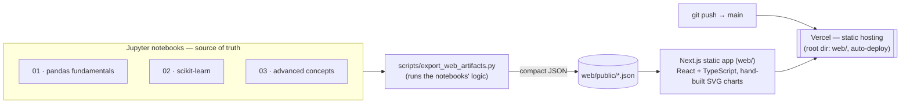

# Data Preprocessing for Machine Learning — A Visual, Hands-On Reference

> Learn every core data-preprocessing technique by *seeing* what each one does to real data — three runnable notebooks plus a live, no-backend web explainer.

[](https://data-preprocessing.vercel.app)
[](https://data-preprocessing.vercel.app)


[](LICENSE)

---

## Recruiter TL;DR

- **What it is:** an end-to-end teaching reference for ML data preprocessing — 3 executed Jupyter notebooks (pandas → scikit-learn → advanced) paired with an interactive web app that visualizes every step *before and after*.
- **Hardest problem solved:** turning a notebook's analysis into a **zero-backend interactive demo** — a Python export step precomputes compact JSON artifacts that a static Next.js/TypeScript app renders as hand-built SVG charts, so the whole thing deploys to Vercel with no server and nothing leaving the browser.
- **Live:** **[data-preprocessing.vercel.app](https://data-preprocessing.vercel.app)** — auto-deploys on every push to `main`.

---

## Overview & motivation

A model is only as good as the data it's trained on, yet preprocessing is the step most tutorials rush through. This project is a **complete, beginner-friendly reference** that treats preprocessing as the main event: every technique is demonstrated on a real dataset, explained in plain language, and — in the companion web app — shown as an interactive *before/after* so you can see exactly what changes.

It's built as a **portfolio / teaching piece**: the notebooks are the deep reference; the web app makes the concepts legible at a glance to someone who won't run a notebook.

**Dataset:** the [seaborn Titanic dataset](https://github.com/mwaskom/seaborn-data) (loaded in-code, no download) — chosen because it naturally exercises everything: real missing values (`age`, `deck`, `embarked`), duplicates, mixed numeric/categorical types, class imbalance (62% died / 38% survived), and both a continuous (`fare`) and a binary (`survived`) target. Notebook 03 adds seaborn's `taxis` dataset for the datetime section.

---

## 🔗 Live demo

**[→ Open the interactive explainer](https://data-preprocessing.vercel.app)**

A static, client-side web app with one tab per preprocessing step — Missing Values, Scaling, Encoding, Outliers, Datetime, PCA, Class Imbalance — each showing a precomputed before/after with hover tooltips and a "how to read this" note. No server, no data leaves your machine.

---

## Features

- **Missing values** — detection (`isna`), dropping (`dropna`), and imputation (`fillna` constant/mean/median/mode, `SimpleImputer`, `KNNImputer`), with a visual of how each strategy reshapes the age distribution.
- **Feature scaling** — `StandardScaler`, `MinMaxScaler`, `RobustScaler`, `MaxAbsScaler`, `Normalizer`, fit on training data only.
- **Categorical encoding** — `get_dummies`, `OneHotEncoder`, `OrdinalEncoder`, `LabelEncoder`, `TargetEncoder`, and frequency encoding, with a side-by-side view of the width/leakage trade-offs.
- **Outlier detection** — IQR rule, z-score rule, and multivariate `IsolationForest`, each with its own visualization.
- **Datetime features** — `.dt` component extraction plus cyclical (sine/cosine) encoding so hour 23 sits next to hour 0.
- **Dimensionality reduction** — `PCA` and `TruncatedSVD` with a scree plot and 2D projection.
- **Class imbalance** — `SMOTE` applied to the training set only.
- **Leakage-safe pipelines** — `ColumnTransformer` + `Pipeline`, persisted with `joblib`.
- **Interactive web explainer** — a static Next.js app rendering the above from precomputed JSON, deployed on Vercel.

---

## Architecture

The notebooks are the single source of truth. A Python export step runs the notebooks' exact logic and writes small JSON artifacts; the web app is a **pure static site** that fetches those artifacts and draws them client-side. There is deliberately **no inference server** — this keeps the whole thing deployable as static content on Vercel, fast to load, and private (nothing is uploaded).



**Why this shape?** The obvious alternative — serving the trained `joblib` pipelines behind a live API — needs a Python runtime, cold starts, and a server to maintain. For a teaching explainer that only ever shows *precomputed* before/after results, exporting static JSON is simpler, cheaper, faster, and keeps the demo working with zero backend.

---

## Tech stack

| Layer | Tools (versions from manifests) | Notes |
|---|---|---|
| Notebooks & data | Python 3.12, pandas ≥2.2, NumPy ≥1.26 | Core preprocessing in pandas |
| ML | scikit-learn ≥1.3, imbalanced-learn ≥0.12, joblib ≥1.3 | `TargetEncoder` needs sklearn ≥1.3 |
| Plotting | matplotlib ≥3.9, seaborn ≥0.13 | In-notebook visuals + dataset loading |
| Export | nbconvert ≥7.16, jupyter ≥1.1 | Notebook execution + JSON export |
| Web | Next.js 15, React 19, TypeScript 5.7 | Static export, no runtime deps beyond React |
| Hosting | Vercel | Static site, auto-deploy from `main` |

Charts are hand-built inline SVG (no charting library) to keep the client bundle tiny and fully self-contained.

---

## Skills demonstrated

- **Data preprocessing & feature engineering** — imputation, scaling, encoding, outlier detection, datetime features, PCA, class balancing.
- **Data engineering / ETL** — a reproducible pipeline that transforms raw data into a model-ready state and into compact serving artifacts.
- **Leakage-aware ML fundamentals** — train/test discipline, fit-on-train-only transformers, scikit-learn `Pipeline`/`ColumnTransformer`.
- **Front-end data visualization** — React + TypeScript, hand-built SVG charts (bar/box/scatter/histogram/strip), interactive tooltips, responsive theming.
- **System design** — deliberate static-export architecture (documented trade-off) that removes the need for a backend.
- **Cloud deployment** — Vercel, monorepo subdirectory root, Git-triggered auto-deploys.

---

## Repository structure

```
Data-Preprocessing/
├── 01_pandas_fundamentals.ipynb     # EDA, missing values, dtypes, reshaping, feature engineering (pandas/NumPy)
├── 02_sklearn_preprocessing.ipynb   # imputers, scalers, encoders, split/leakage, PCA, SMOTE, pipelines, joblib
├── 03_advanced_concepts.ipynb       # outlier detection, datetime features, target/frequency encoding
├── scripts/
│   └── export_web_artifacts.py      # runs the notebooks' logic → web/public/*.json
├── web/                             # Next.js static explainer (deploys to Vercel)
│   ├── app/                         #   page + one component per tab + shared chart lib
│   └── public/*.json                #   precomputed artifacts the app renders
├── requirements.txt
├── LICENSE                          # MIT
└── README.md
```

---

## Getting started

### Notebooks

```bash
pip install -r requirements.txt
jupyter lab        # or: jupyter notebook
```

Open the notebooks in order (`01` → `02` → `03`). Each is self-contained and reloads its own data, so they can also be run independently. The first run downloads the seaborn datasets (Titanic, taxis) from GitHub and caches them locally — an internet connection is needed once.

### Web app

```bash
# 1. (re)generate the JSON artifacts from the notebooks' logic
python scripts/export_web_artifacts.py      # writes web/public/*.json

# 2. run the app
cd web
npm install
npm run dev                                  # http://localhost:3000
```

---

## Usage

Regenerate the web artifacts any time the notebooks change:

```bash
python scripts/export_web_artifacts.py
# → wrote missing.json, scaling.json, encoding.json, outliers.json,
#   datetime.json, pca.json, smote.json  (into web/public/)
```

Each tab in the app is a small client component that fetches one artifact and renders it — for example the scaling tab reads `scaling.json` (a five-number summary per scaler) and draws a boxplot per scaler.

---

## Testing

There is **no formal unit-test suite** — this is a teaching/reference project, and the notebooks are the deliverable. Correctness is verified two ways instead:

- **Notebooks execute clean end-to-end** via `jupyter nbconvert --to notebook --execute` (all three run with zero error outputs).
- **The web app type-checks and builds** via `npm run build` (TypeScript strict, static generation).

```bash
# verify a notebook runs top-to-bottom with no errors
jupyter nbconvert --to notebook --execute 01_pandas_fundamentals.ipynb --stdout > /dev/null

# verify the web app compiles
cd web && npm run build
```

A notebook-execution smoke test in CI would be a sensible next addition (see Roadmap).

---

## Deployment

Deployed as a **static site on Vercel**: **[data-preprocessing.vercel.app](https://data-preprocessing.vercel.app)**.

- The Vercel project's **Root Directory** is set to `web/` (the app lives in a subdirectory of this repo).
- Every push to `main` triggers an automatic production build (`next build`) and deploy.
- No environment variables or secrets are required — the app is fully client-side and reads only the committed JSON artifacts.

To deploy your own copy: import the repo at [vercel.com/new](https://vercel.com/new), set **Root Directory** to `web`, and deploy (Next.js is auto-detected).

---

## Impact / results

This is a learning resource, so its value is pedagogical rather than metric-driven — there are no usage or performance numbers to report, and none are invented here. Concretely, it:

- replaces a scattered set of preprocessing snippets with **one coherent, executed reference** spanning missing values through pipelines;
- makes each technique's effect **visible** (e.g. seeing mean-imputation spike a single histogram bar, or a scaler preserve a distribution's shape while changing its range) rather than described in the abstract;
- ships that intuition as a **shareable link** anyone can open without installing anything.

---

## Roadmap / known limitations

- **No CI** — a GitHub Actions job that runs `nbconvert --execute` on the notebooks and `npm run build` on the app would guard against silent rot.
- **Sampled visuals** — the outlier plots render a representative sample of the data (noted in-app), so the exact count of highlighted points is smaller than the stated full-data totals.
- **Single dataset spine** — everything centers on Titanic (plus taxis for datetime); additional datasets could broaden the examples.
- **No automated tests** — see Testing above.

---

## License

[MIT](LICENSE) © 2026 Shivani Bokka
